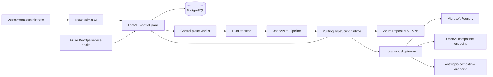

# Pullfrog Azure: Azure-first pull request agent

- **Status:** Approved design
- **Date:** 2026-08-09
- **Repository:** `lhajoosten/pullfrog-azure`

## 1. Summary

Pullfrog Azure is a separate, open-source, Azure-first implementation of Pullfrog for Azure DevOps. It reviews Azure Repos pull requests from a pipeline owned by the user. It supports automatic reviews and explicit `@pullfrog` comment commands, without introducing Azure Boards automation.

The first public alpha uses a hybrid architecture:

- A centrally deployed control plane manages configuration, authentication, events, dispatch, and run history.
- The agent runtime executes inside an existing Azure Pipeline in the user's Azure DevOps project.
- A narrow `RunExecutor` interface leaves room for hosted Pullfrog workers later without making them part of the alpha.

The project is a new implementation rather than a generic SCM extension inside the existing GitHub Action. Mature security and runtime concepts may be ported selectively from Pullfrog under its MIT license, with attribution and preserved notices where required.

## 2. Goals

The public alpha must:

1. Review Azure Repos pull requests automatically when a pull request is created or its source revision changes.
2. Respond to read-only `@pullfrog review` and `@pullfrog explain` commands.
3. Execute the runtime in a user-provided Azure Pipeline.
4. Authenticate to Azure DevOps using:
   - a personal access token;
   - an Entra application identity;
   - an Entra delegated user.
5. Support one Entra tenant per Pullfrog deployment.
6. Prefer Microsoft Foundry as the model platform, using either an API key or Entra authentication.
7. Support direct OpenAI-compatible and Anthropic Messages-compatible endpoints.
8. Allow OpenAI, Anthropic Claude, Kimi/Moonshot, DeepSeek, and similar providers to be configured as deployments rather than hard-coded product branches.
9. Provide a minimal administration interface for connections, repositories, pipelines, models, service hooks, and runs.
10. Keep credentials outside agent-visible context and prevent model output from expanding run permissions.

## 3. Non-goals

The first public alpha does not include:

- Azure Boards or work-item automation;
- GitHub support in this repository;
- multiple Entra tenants in one deployment;
- hosted Pullfrog workers;
- billing, usage invoicing, or general analytics;
- automatic credential or model fallback;
- model-protocol translation;
- cross-repository or fork writes;
- a writing-capable `@pullfrog fix` command;
- general enterprise role administration beyond a deployment administrator allowlist.

## 4. Architectural principles

The implementation follows these boundaries:

- Backend request flow is `Router -> Service -> Repository/async ORM -> PostgreSQL`.
- FastAPI routers validate requests and map responses; business decisions live in services.
- SQLAlchemy access is async-only and uses SQLAlchemy 2.0 patterns.
- React pages remain thin, API access goes through typed hooks, and presentational components do not own data fetching.
- Runtime permissions are selected by the control plane before the model runs.
- Credentials are never passed into prompts or exposed through agent tools.
- Incoming service-hook events, pull request text, repository content, and model output are all untrusted input.
- Every external side effect is idempotent or associated with a stable external identifier.
- Configuration chooses authentication and protocol explicitly; the system does not silently fall back to another credential or model.
- The first implementation optimizes for a small, auditable vertical slice rather than generic abstractions for unimplemented SCMs or executors.

## 5. System architecture

The monorepo contains three deployable applications and shared packages:

- **Control plane:** FastAPI, async SQLAlchemy, PostgreSQL, and a separate worker process.
- **Pipeline runtime:** TypeScript process started by the user's Azure Pipeline.
- **Admin UI:** React and TypeScript single-page application served with or alongside the control plane.
- **Shared contracts:** generated API types, event schemas, runtime contracts, and model protocol types where cross-language sharing is practical.



### 5.1 RunExecutor boundary

The control plane dispatches work through a small interface:

- `dispatch(run)` returns an external execution identifier;
- `get_status(external_id)` reports executor state;
- `cancel(external_id)` requests cancellation when supported.

`AzurePipelineExecutor` is the only alpha implementation. A future hosted executor must implement the same behavioral contract and cannot change the runtime's authorization model.

### 5.2 Runtime bootstrap

The Azure Pipeline receives only a run identifier and a short-lived, one-time bootstrap credential through a protected pipeline mechanism. The runtime exchanges these over TLS for a run-scoped context containing:

- the immutable repository and pull request identifiers;
- the expected source commit SHA;
- the allowed run mode and tool capabilities;
- the selected model-deployment slugs;
- short-lived tokens or run-scoped credential material needed by local adapters;
- callback credentials valid only for that run.

The bootstrap credential is stored only as a hash, expires quickly, can be consumed once, and is bound to the expected run and executor. Secrets exist in runtime memory only and are removed before any data is sent to the agent harness.

## 6. Azure DevOps authentication

An `AzureDevOpsConnection` has one explicit authentication mode. Repositories bind to a connection instead of inheriting a global implicit credential.

### 6.1 Personal access token

The administrator supplies a PAT with the smallest necessary Azure DevOps scopes. Pullfrog stores it encrypted and never returns it after creation. Automated and comment-triggered runs may use the bound PAT regardless of the actor who caused the event; actor authorization is still evaluated separately for permission-sensitive commands.

### 6.2 Entra application identity

Application identity is supported through confidential-client credentials. Workload identity federation is preferred for deployed workloads. Certificate credentials and client secrets are supported when federation is not available. Managed identity is a later deployment adapter, not a prerequisite for the alpha.

The service principal must be added to the Azure DevOps organization and granted the repository and pipeline permissions required by the configured mode. Pullfrog tests both token acquisition and a harmless Azure DevOps API call so that missing organization membership is distinguishable from invalid credentials.

Azure DevOps tokens target resource ID `499b84ac-1321-427f-aa17-267ca6975798` with the `.default` scope. The implementation follows Microsoft's [Azure DevOps Entra authentication guidance](https://learn.microsoft.com/en-us/azure/devops/integrate/get-started/authentication/entra?view=azure-devops).

### 6.3 Entra delegated user

Delegated authentication uses the authorization-code flow with PKCE, state, and nonce validation. A delegated connection that may execute automated or delayed runs requests offline access so that it can renew tokens without an interactive browser session. Refresh-token material is envelope-encrypted and rotation replaces the stored credential atomically.

The UI identifies the delegated account and its tenant but never exposes tokens. Revocation, consent failure, or lost Azure DevOps access produces an explicit connection error and never causes fallback to another identity. The flow follows Microsoft's [Azure DevOps Entra OAuth guidance](https://learn.microsoft.com/en-us/azure/devops/integrate/get-started/authentication/entra-oauth?view=azure-devops).

### 6.4 Single-tenant deployment

Each deployment has one configured Entra tenant ID. OIDC login, application registrations, delegated users, and Entra-backed model connections must belong to that tenant. PAT-backed Azure DevOps connections may target an allowed Azure DevOps organization, but do not change the deployment tenant.

## 7. Model authentication and routing

### 7.1 Connection and deployment model

A `ModelConnection` describes network and authentication configuration. It has one of three kinds:

- `foundry`;
- `direct_openai`;
- `direct_anthropic`.

A `ModelDeployment` gives a stable internal slug to an upstream deployment or model. It declares:

- connection ID;
- upstream model or deployment name;
- protocol: `openai_responses`, `openai_chat_completions`, or `anthropic_messages`;
- capabilities such as tool use, streaming, image input, and reasoning controls;
- context and output limits;
- optional provider-specific parameters allowed by policy;
- health status from the last connection test.

Repository policy chooses separate review and task model slugs. OpenAI, Claude, Kimi/Moonshot, and DeepSeek are presets or examples, not branches in runtime logic.

### 7.2 Microsoft Foundry

Foundry is the preferred model platform. A Foundry connection uses either:

- an API key when local authentication is enabled on the resource; or
- Entra authentication using an application identity or delegated identity.

Entra tokens use scope `https://ai.azure.com/.default`. Authentication mode is explicit and a rejected API key never triggers an automatic Entra fallback. Foundry OpenAI-compatible v1 endpoints are used for OpenAI-compatible deployments. Claude deployments that expose the native Anthropic Messages surface use `/anthropic/v1/messages`. This follows the current [Foundry authentication](https://learn.microsoft.com/en-us/azure/foundry/concepts/authentication-authorization-foundry), [Foundry endpoint](https://learn.microsoft.com/en-us/azure/foundry/foundry-models/concepts/endpoints), and [Claude on Foundry](https://learn.microsoft.com/en-us/azure/foundry/foundry-models/how-to/use-foundry-models-claude) guidance.

### 7.3 Direct endpoints

Direct connections support provider-hosted or third-party endpoints even when a model is unavailable in the Foundry catalog:

- OpenAI-compatible connections support Responses or Chat Completions as declared by the deployment.
- Anthropic-compatible connections support the Messages protocol.
- Authentication may be an API key or bearer credential as declared by the connection.

Custom endpoints require HTTPS. Non-public or private-network endpoints must be enabled by deployment policy rather than accepted implicitly. URL validation and network egress controls prevent a configured model endpoint from becoming an unrestricted SSRF primitive.

### 7.4 Local model gateway

Each runtime starts a loopback-only gateway protected by a random run-scoped secret. OpenCode communicates only with this gateway. The gateway:

- exposes only model slugs allowed for the run;
- resolves connection and deployment configuration;
- injects credentials outside agent-visible request bodies;
- refreshes Entra tokens when necessary;
- supports streaming and tool calls for the declared upstream protocol;
- records bounded operational metrics without logging prompts or outputs;
- does not translate one model protocol into another.

On 401 or 403 it may refresh an Entra token once. It applies bounded retries to 408, 429, and selected 5xx responses. It does not retry validation errors, context-limit failures, content-policy rejections, or invalid model responses blindly.

## 8. Triggers and service hooks

Activating a repository creates three Azure DevOps service-hook subscriptions, filtered to the configured project and repository:

- pull request created;
- pull request updated;
- pull request commented on.

The control plane manages subscriptions through the Azure DevOps REST APIs, stores their external IDs, and can send a test notification. See Microsoft's [service-hook subscription create API](https://learn.microsoft.com/en-us/rest/api/azure/devops/hooks/subscriptions/create?view=azure-devops-rest-7.1).

Each repository has a high-entropy webhook token. Only its hash is stored. Rotation creates replacement subscriptions before removing the old subscriptions.

The webhook endpoint validates:

- the token using a constant-time comparison;
- content type and a strict body-size limit;
- event type and minimal schema;
- organization, project, and repository identifiers;
- whether the pull request belongs to the configured repository;
- the computed idempotency key.

The endpoint persists the event and a dispatch job transactionally, then returns `202 Accepted`. It does not call the model or queue an Azure Pipeline inside the HTTP request.

### 8.1 Durable PostgreSQL queue

The alpha uses a PostgreSQL-backed job table instead of introducing a separate message broker. Workers claim jobs with row-level locks and `SKIP LOCKED`, permitting multiple worker processes without duplicate concurrent claims.

Job states are `pending`, `claimed`, `dispatching`, `dispatched`, `retry_wait`, and `failed`. Retryable jobs have a bounded attempt count and next-attempt timestamp. Event persistence and job creation occur in the same transaction.

### 8.2 Comment commands

Comment bodies are processed by a deterministic parser before any text reaches the agent. The alpha recognizes read-only commands such as:

- `@pullfrog review`;
- `@pullfrog explain <question>`.

The parser extracts the command, free text, and Azure DevOps actor identity. The control plane chooses the run mode and tool policy. The model cannot turn arbitrary prose into a privileged command or promote a read-only run to write mode.

`@pullfrog fix` is reserved for a later phase and is rejected in the public alpha.

## 9. Runtime and Azure Repos tools

OpenCode is the first agent harness. It runs locally in the Azure Pipeline alongside a local MCP server and the model gateway.

### 9.1 Automated review mode

`automated_review` can:

- read pull request metadata, iterations, changes, commits, files, and existing threads;
- publish or update review threads and run status;
- use only the configured review model.

It cannot modify the checkout, commit, push, edit pipeline configuration, or change repository settings.

### 9.2 Mention task mode

`mention_task` handles read-only questions and review requests in the alpha. It can inspect the pull request and repository and reply in a thread. It cannot write repository content.

A later restricted write mode may be enabled only for an explicit `@pullfrog fix`, an authorized actor, and a repository policy that allows it. That mode is limited to the current pull request source branch in the same repository. It forbids default-branch writes, forks, cross-repository changes, force pushes, branch deletion, tags, and pipeline modification. A source-SHA comparison immediately before commit and push prevents stale writes.

### 9.3 Tool surface

The initial Azure Repos MCP surface contains focused tools for:

- pull request metadata;
- iterations and changes;
- commits and changed files;
- repository file reads;
- existing review threads;
- general and inline thread creation;
- thread reply and status update;
- run progress reporting.

Inline comments are mapped to Azure DevOps iteration, path, side, and change-tracking coordinates. When the position cannot be proven reliable, the runtime publishes a general thread containing the file path and line reference rather than guessing.

## 10. Run data flow and idempotency

The end-to-end flow is:

1. Azure DevOps sends a service-hook event.
2. The control plane validates and persists it with an idempotency key.
3. A worker normalizes the event and loads repository policy.
4. The service verifies the current pull request source SHA through Azure DevOps.
5. The service creates or supersedes an `AgentRun`.
6. `AzurePipelineExecutor` queues the configured pipeline.
7. The runtime exchanges its one-time bootstrap credential for run context.
8. The runtime fetches pull request data, starts the local MCP server and model gateway, and invokes OpenCode.
9. The runtime publishes review threads using stable run and finding identifiers.
10. The runtime reports a terminal status and releases credential material.

Idempotency uses event type plus stable Azure event/resource identifiers. At most one active automated review exists for a repository, pull request, and source SHA. A newer source SHA supersedes an older run. Published findings retain stable IDs and observed Azure thread versions so retrying publication updates or skips existing work instead of duplicating comments.

Before publication, commit, or push, the runtime compares the current pull request source SHA with the run's expected SHA. A mismatch ends the run as `superseded`.

## 11. Control-plane API

The versioned REST API is rooted at `/api/v1` and grouped into:

- `/auth`;
- `/azure-connections`;
- `/repositories`;
- `/executors`;
- `/model-connections`;
- `/model-deployments`;
- `/service-hooks`;
- `/runs`;
- `/runtime`.

Secrets are accepted only during creation or full replacement and never returned. Deleting a connection that is still referenced is rejected until dependent resources are rebound. Connection tests are explicit actions and do not silently alter active configuration.

All configuration mutations create an audit entry with actor, timestamp, action, resource ID, and non-secret change metadata.

## 12. Data model

The initial schema contains:

| Entity | Responsibility |
|---|---|
| `deployment_settings` | Single-tenant Entra and deployment settings |
| `admin_identity` | Allowed user or group object IDs |
| `credential_secret` | Envelope-encrypted secret material and key version |
| `azure_devops_connection` | PAT, application, or delegated connection metadata |
| `repository` | Organization, project, repository, trigger, and run policy |
| `service_hook_subscription` | Azure subscription ID, event type, token hash, and health |
| `pipeline_executor_config` | Pipeline ID, ref, fixed parameters, and status |
| `model_connection` | Foundry or direct endpoint and authentication metadata |
| `model_deployment` | Stable slug, upstream model, protocol, and capabilities |
| `repository_model_policy` | Review and task model choices per repository |
| `incoming_event` | Bounded event record, idempotency key, and processing state |
| `dispatch_job` | Durable PostgreSQL queue record |
| `agent_run` | PR, source SHA, mode, executor, model, status, and timing |
| `run_event` | State transitions and sanitized operational diagnostics |
| `bootstrap_token` | Hashed, expiring, single-use runtime credential |
| `audit_entry` | Administrator configuration changes without secret values |

The database does not retain full prompts, repository files, or model outputs by default. It stores bounded metadata such as deployment slug, token counts when available, duration, retry count, external request identifiers, sanitized error category, and published thread IDs. Incoming event retention is short and configurable.

### 12.1 Secret storage

Credentials use envelope encryption. A key-encryption key is obtained from Azure Key Vault in production; a local development key is permitted only for local environments. Ciphertext, nonce, algorithm metadata, and key version are stored in PostgreSQL. Decrypted values are held only for the shortest practical in-memory lifetime.

## 13. Administration UI

The React UI uses single-tenant Entra OIDC login. Access is restricted by configured Entra group object IDs and/or individual user object IDs. Browser authentication uses a server-side session with `HttpOnly`, `Secure`, and appropriate `SameSite` cookie settings, inactivity and absolute expiration, and CSRF protection for mutations.

The initial screens are:

1. **Overview:** component health, active repositories, recent runs, and configuration errors.
2. **Azure DevOps connections:** add, test, replace, and inspect usage of PAT, application, and delegated connections.
3. **Repositories:** bind organization/project/repository, triggers, pipeline, model policy, and service hooks.
4. **Pipeline executor:** configure and test an existing Azure Pipeline.
5. **Model connections:** configure and test Foundry, OpenAI-compatible, and Anthropic-compatible endpoints.
6. **Model deployments:** create stable slugs and declare protocols and capabilities.
7. **Runs:** inspect status and sanitized errors and retry an eligible failed run after a source-SHA check.

The UI never re-renders a stored secret. It shows authentication type, replacement time, safe expiration metadata, connection-test status, and dependent resources.

A repository becomes active only after its Azure DevOps connection, pipeline executor, model deployment, and required service hooks have passed validation.

## 14. Run states and error handling

The run state machine is:

```text
received
  -> validating
  -> queued
  -> pipeline_starting
  -> runtime_bootstrapping
  -> running
  -> publishing
  -> succeeded

Any stage may end in:
  -> superseded
  -> cancelled
  -> timed_out
  -> failed
```

Errors have explicit categories:

| Category | Retry behavior |
|---|---|
| `configuration_error` | No retry |
| `authentication_error` | One token refresh where applicable, then stop |
| `authorization_error` | No retry |
| `policy_denied` | No retry; return a clear response for mention commands |
| `stale_revision` | End as `superseded` |
| `transient_upstream` | Bounded exponential backoff with jitter |
| `pipeline_error` | Retry only when dispatch is known not to have succeeded |
| `model_error` | Retry only when classified as transient |
| `publish_error` | Retry publication without rerunning the agent |
| `internal_error` | Safe failure with sanitized diagnostics |

Separate timeouts apply to pipeline dispatch, runtime bootstrap, Azure DevOps calls, model connection and streaming, total agent execution, and publication. A watchdog marks abandoned intermediate states and reconciles executor status.

Progress is represented by at most one managed pull request status thread. Configuration failures appear primarily in the admin UI. A user-triggered command receives a concise failure reply after retries are exhausted. A superseded run publishes no review for the stale commit.

## 15. Testing strategy

All developer and CI checks are exposed through a root `Taskfile`. `task check` is the complete pre-commit validation target.

### 15.1 Unit tests

Unit tests cover command parsing, event normalization, idempotency keys, state transitions, retry classification, tool policy, credential selection, model routing, secret redaction, and inline-comment coordinate mapping.

### 15.2 Backend integration tests

Tests use a real temporary PostgreSQL instance for async repositories, Alembic upgrade and downgrade, transactional outbox behavior, concurrent claims, duplicate events, bootstrap consumption, secret encryption, audits, API authentication, sessions, and CSRF.

### 15.3 Azure DevOps contract tests

A local mock service represents the REST contracts for pull requests, iterations, changes, files, threads, service hooks, and pipeline queue/status operations. Fixtures include PAT and bearer authentication and 401, 403, 409, 429, and selected 5xx responses. Optional live smoke tests run against a dedicated Azure DevOps test organization and are not part of every local check.

### 15.4 Model gateway contract tests

Independent tests cover Foundry, direct OpenAI-compatible, and direct Anthropic-compatible routes, including streaming, tool calls, authentication, token refresh, rate limiting, invalid responses, and safe logging.

### 15.5 Runtime tests

Deterministic fixtures provide a test repository, pull request diff, model responses, expected tool calls, and expected general or inline review threads. Tests prove that read-only runs cannot access write tools and that untrusted repository or model content cannot expand capabilities.

### 15.6 Frontend and security tests

Frontend component and hook tests cover configuration workflows, secret replacement, errors, and accessibility. A small Playwright suite covers the primary administrator flow. Security tests cover webhook replay, token rotation, SSRF controls, prompt-injection boundaries, secret leakage, and forbidden branch or fork writes.

### 15.7 Canonical end-to-end paths

Three canonical paths exercise the important combinations without testing the full Cartesian product:

1. PAT plus Foundry API key using an OpenAI-compatible review deployment.
2. Entra application identity plus Foundry Entra authentication using an Anthropic Messages deployment.
3. Entra delegated Azure DevOps identity plus a direct OpenAI- or Anthropic-compatible deployment for `@pullfrog review` or `@pullfrog explain`.

## 16. Implementation phases

### Phase 0: repository and contracts

- Monorepo conventions, Taskfile, and CI.
- Architecture decisions and API contracts.
- Local PostgreSQL development environment.
- MIT license, `NOTICE`, and source attribution for ported files.

### Phase 1: control-plane foundation

- FastAPI, async SQLAlchemy, Alembic, and worker process.
- Single-tenant Entra administrator login.
- Envelope-encrypted secret storage and audit trail.
- Azure DevOps PAT, application, and delegated connections.
- Foundry, direct OpenAI-compatible, and direct Anthropic-compatible connections.
- Minimal React screens to configure and test connections.

### Phase 2: usable read-only review

- Repository, service-hook, and Azure Pipeline configuration.
- Durable event processing and `AzurePipelineExecutor`.
- One-time runtime bootstrap.
- Azure Repos read-only MCP tools.
- OpenCode runtime and local model gateway.
- Automatic pull request review and Azure DevOps thread publication.

This phase is the first usable vertical release.

### Phase 3: mention commands and operations

- `@pullfrog review` and `@pullfrog explain`.
- Actor identity checks.
- Run overview, safe retry, and sanitized diagnostics.
- Service-hook repair, health checks, timeout reconciliation, and retry hardening.

Completion of phases 0 through 3 produces the public alpha. The following phases are post-alpha additions and do not delay the initial read-only release.

### Phase 4: restricted write mode

- Explicit, policy-controlled `@pullfrog fix`.
- Actor authorization and current-source-SHA enforcement.
- Same-repository source branch commits and pushes only.
- Default-branch, fork, force-push, tag, deletion, and pipeline-modification prohibitions.

### Phase 5: production reference deployment

- Bicep for Azure Container Apps, Azure Database for PostgreSQL, and Azure Key Vault.
- Workload identity where possible.
- Retention, backup, observability, and upgrade documentation.

Hosted Pullfrog workers remain outside these phases and arrive as a later `RunExecutor` implementation.

## 17. Public alpha acceptance criteria

The public alpha is complete when:

1. A deployment administrator can sign in through the configured single Entra tenant.
2. PAT, application-identity, and delegated-user Azure DevOps connections can be created and tested.
3. A repository, existing Azure Pipeline, and model deployment can be bound and validated.
4. Pullfrog can install and test the required service hooks.
5. Pull request creation and source updates start exactly one review per current commit SHA.
6. Read-only `@pullfrog review` and `@pullfrog explain` commands work.
7. The runtime can use only tools and model deployments authorized for its run.
8. A review is published as one or more Azure DevOps threads.
9. Duplicate, replayed, and stale events do not create duplicate or obsolete reviews.
10. Credentials do not appear in logs, API responses, agent context, or audit entries.
11. Failed runs have actionable sanitized diagnostics and can be retried only when safe.
12. Alembic upgrade and downgrade work and `task check` passes.
13. A clean single-tenant deployment can be installed using the project documentation.

## 18. Open-source provenance

The new repository is MIT-licensed. Selectively ported Pullfrog code must retain applicable copyright and license headers. A root `NOTICE` records the upstream repository, commit provenance, and files or modules that contain derived work. When provenance is unclear or the GitHub-specific implementation would bring unnecessary coupling, the functionality is reimplemented from the approved behavior and covered with independent tests.

No proprietary Pullfrog web application or API code is assumed to be available or copied.

## 19. Resolved design decisions

The design intentionally resolves the following choices:

- Azure-first separate repository instead of modifying the GitHub Action into a generic SCM platform.
- Azure Repos pull requests only; no Azure Boards.
- Both automatic and mention triggers.
- Azure Pipeline execution first, behind `RunExecutor`.
- PAT, Entra application identity, and Entra delegated user authentication.
- One Entra tenant per deployment.
- Foundry first, with explicit API-key or Entra authentication.
- Direct OpenAI-compatible and Anthropic-compatible endpoints always supported.
- No protocol, credential, or model fallback.
- Minimal React administration UI.
- PostgreSQL-backed durable work queue for the alpha.
- Read-only public alpha; restricted write mode delivered separately.
- Selective, attributed reuse of mature Pullfrog MIT-licensed components.

Package versions, exact directory names inside the monorepo, and individual implementation task boundaries are selected and pinned in the implementation plan. They do not alter the architecture or product behavior defined here.
